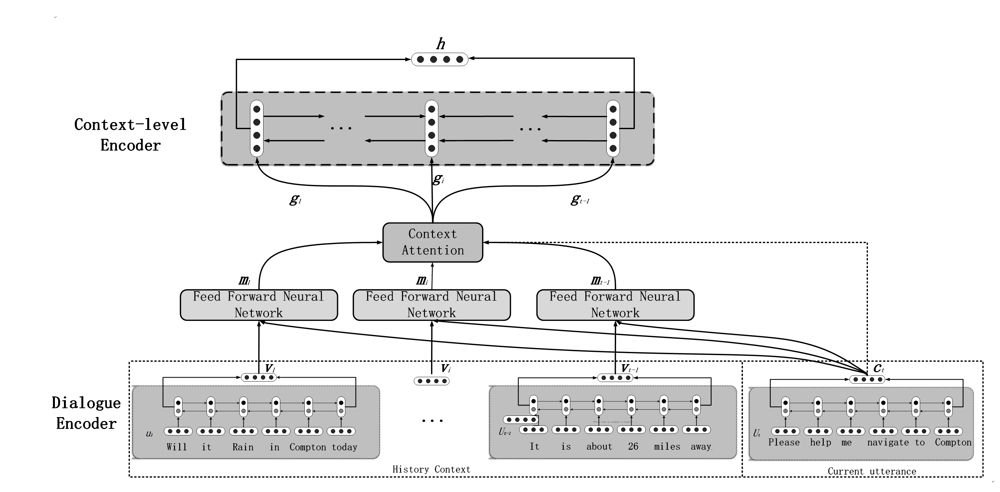
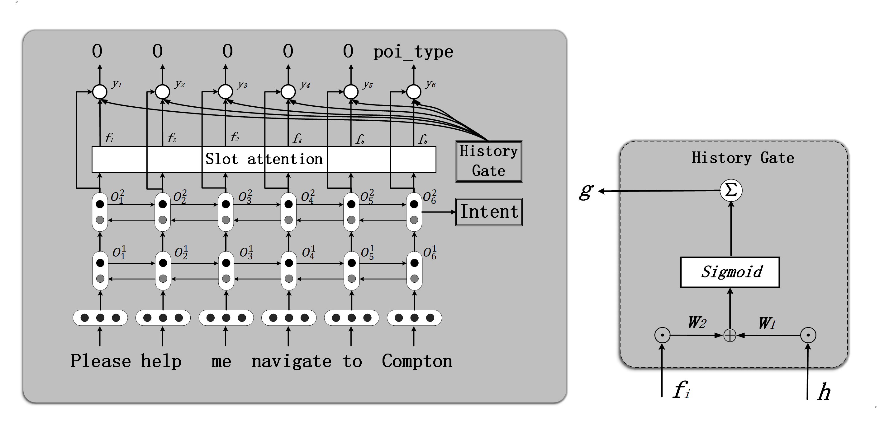

# IDSF





## Requirements

```
pytorch==0.4
nltk==3.5.1
sklearn_crfsuite
```

## Run

```
python3 main.py
```

## Data

 [Stanford Multi-turn dataset](https://nlp.stanford.edu/blog/a-new-multi-turn-multi-domain-task-oriented-dialogue-dataset/) 

### sample


#### Multi domain dialogue

```

User：Will it rain in Compton today? |||O O O O location date|||weather
Bot：Compton is not showing a forecast for raining today.
User：OK. |||O|||thanks
Bot：You are welcome.
User: How far is it to Compton? ||| O O O O O poi_type|||navigate
Bot: It is about 26 miles away.
User: Please help me navigate to Compton. ||| O O O O O O poi_type|||navigate
Bot: Follow the directions on your screen and enjoy the trip!

```


## Devset Result

`Intent Detection : 0.9567 (Accuracy)`


`Slot Extraction`

| Model | ID acc | SF acc | SF F1 |
| ------ | ------ | ------ | ------ |
| Seq2seq(liu bing) | 0.9388 | 0.9172 | 0.9257 |
| Seq2seq with history | 0.9453 | 0.9163 | 0.9251 |
| lstm  | 0.9530 | 0.9221 | 0.9220 |
| lstm with history | 0.9551 | 0.9212 | 0.9217 |
| LHC | 0.9473 | 0.9256 | 0.9256 |
| LHCA | 0.9526 | 0.9293 | 0.9280 |
| LHCG | 0.9567 |  0.9276 | 0.9273 |
| LHCAG(our model ) | 0.9567 | 0.9321 | 0.9318 |


`valued Slot Extraction`

| Model | Acc | Rec | F1 |
| ------ | ------ | ------ | ------ |
| lstm | 0.571 | 0.757 | 0.606 |
| lstm with history | 0.672 | 0.761 | 0.675 |
| LHC | 0.685 | 0.772 | 0.691 |
| LHCA | 0.772 |0.766|0.757|
|LHCG|0.700|0.766|0.713
|LHCAG(our model )|0.775|0.767|0.763|
